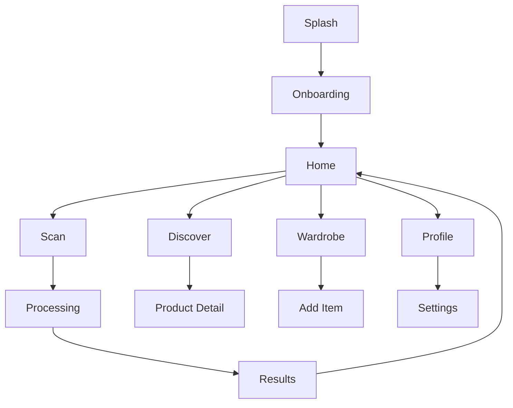

# LookCircuit UI/UX Product Requirements Document

## Principal Product Designer + Frontend Architect PRD
**Version:** 1.0  
**Last Updated:** January 2026

---

## Document Style Guide

> **Output Style Requirements:**
> - ✓ Structured, design-spec level clarity
> - ✓ Developer & designer friendly
> - ✓ No fluff — actionable specifications only
> - ✓ Visually descriptive language
> - ✓ Beautiful font pairings with rationale

---

## 1. Design Inspiration Analysis

### Reference UI Visual Language Extraction

Based on the Orbit app reference screenshots, the following design principles have been identified:

| Element | Observation | LookCircuit Adaptation |
|---------|-------------|------------------------|
| **Background** | Deep black (#0A0A0F) with subtle noise texture | Charcoal-to-midnight gradient with fabric-like texture |
| **Depth** | Layered cards with 60% opacity glass morphism | Frosted glass tiles with fashion photography backdrop |
| **Color Accents** | Purple (#8B5CF6) to pink (#EC4899) gradients | Sapphire (#3B82F6) to rose (#F43F5E) — fashion-forward |
| **Corner Radius** | 16-24px consistently rounded | 20px universal, 28px for hero cards |
| **Typography** | SF Pro-like, high contrast white on dark | Inter/Outfit, hierarchical with accent color highlights |
| **Icons** | Thin-stroke, minimal, symbolic | Rounded, fashion-aware symbols (hanger, palette, face) |
| **Motion** | Orbital animations, planet-like loading states | Fabric ripple, mirror-shimmer, glow pulse effects |
| **Emotional Tone** | Futuristic, premium, calming | Premium, aspirational, self-empowering, approachable |

### Visual Language Translation for LookCircuit

The Orbit app's "cosmic" aesthetic will be reinterpreted as a **"Style Mirror"** concept for LookCircuit:
- **Cosmic orbs → Skin tone swatches with inner glow**
- **Subscription cards → Bento recommendation tiles**
- **Orbital animations → Fabric ripple effects on interactions**
- **Purple gradients → Fashion-forward sapphire-rose spectrum**

---

## 2. Global Design System

### 2.1 Color Palette

```
BACKGROUNDS
├── Primary:      #09090B (Void Black)
├── Surface:      #18181B (Charcoal)
├── Elevated:     #27272A (Graphite)
└── Glass:        rgba(39, 39, 42, 0.6) + blur(20px)

ACCENTS
├── Primary:      #6366F1 (Indigo)
├── Secondary:    #F43F5E (Rose)
├── Success:      #10B981 (Emerald)
├── Warning:      #F59E0B (Amber)
└── Gradient:     linear-gradient(135deg, #6366F1, #EC4899)

TEXT
├── Primary:      #FAFAFA (Snow)
├── Secondary:    #A1A1AA (Zinc-400)
├── Muted:        #71717A (Zinc-500)
└── Accent:       #818CF8 (Indigo-400)

SKIN TONE SWATCHES (Fitzpatrick Scale)
├── Type I:       #FFE4D6
├── Type II:      #F5D0C5
├── Type III:     #D4A574
├── Type IV:      #A67C52
├── Type V:       #8B5A3C
└── Type VI:      #4A3728
```

### 2.2 Corner Radius System

| Component | Radius | Usage |
|-----------|--------|-------|
| Buttons | 12px | CTAs, secondary actions |
| Cards | 20px | Bento tiles, product cards |
| Hero Cards | 28px | Feature highlights, modals |
| Inputs | 12px | Text fields, dropdowns |
| Icons | 8px | Icon backgrounds |
| Full Round | 9999px | Avatars, pills, tags |

### 2.3 Elevation & Depth

```
Level 0: Background (no shadow)
Level 1: Cards — box-shadow: 0 4px 24px rgba(0,0,0,0.4)
Level 2: Modals — box-shadow: 0 8px 32px rgba(0,0,0,0.6)
Level 3: Floating — box-shadow: 0 12px 48px rgba(0,0,0,0.8)

Glass Effect:
  background: rgba(39, 39, 42, 0.6)
  backdrop-filter: blur(20px)
  border: 1px solid rgba(255,255,255,0.08)
```

### 2.4 Typography System & Font Pairing

**Primary Font Pairing:**

```
DISPLAY + HEADINGS          BODY + UI
─────────────────          ──────────
    Outfit                   Inter
    
Modern geometric           Highly legible
Distinct personality       Neutral, clean
Fashion-forward            Developer-trusted
Variable weight            Excellent numerals
```

**Why This Pairing Works:**
- **Contrast principle**: Outfit's geometric curves contrast with Inter's humanist neutrality
- **Shared x-height**: Both fonts have tall x-heights, ensuring visual harmony
- **Weight compatibility**: Both offer 100-900 weights for precise hierarchy
- **Fashion context**: Outfit feels editorial; Inter feels technical → AI meets style

---

**Font Stack (React Native):**

```typescript
// fonts.ts
export const fonts = {
  display: {
    family: 'Outfit',
    weights: {
      regular: 'Outfit-Regular',    // 400
      medium: 'Outfit-Medium',      // 500
      semibold: 'Outfit-SemiBold',  // 600
      bold: 'Outfit-Bold',          // 700
    },
  },
  body: {
    family: 'Inter',
    weights: {
      regular: 'Inter-Regular',     // 400
      medium: 'Inter-Medium',       // 500
      semibold: 'Inter-SemiBold',   // 600
    },
  },
};
```

---

**Type Scale:**

| Token | Font | Size | Weight | Line Height | Letter Spacing | Usage |
|-------|------|------|--------|-------------|----------------|-------|
| `display` | Outfit | 36px | 700 | 1.1 | -0.02em | Splash, hero |
| `h1` | Outfit | 28px | 600 | 1.2 | -0.01em | Page titles |
| `h2` | Outfit | 22px | 600 | 1.3 | 0 | Section headers |
| `h3` | Inter | 18px | 600 | 1.4 | 0 | Card titles |
| `body` | Inter | 16px | 400 | 1.5 | 0 | Paragraphs |
| `body-medium` | Inter | 16px | 500 | 1.5 | 0 | Emphasis |
| `caption` | Inter | 14px | 400 | 1.4 | 0.01em | Descriptions |
| `overline` | Inter | 12px | 600 | 1.3 | 0.08em | Labels (caps) |
| `metadata` | Inter | 12px | 500 | 1.3 | 0.02em | Timestamps |
| `button` | Inter | 16px | 600 | 1.0 | 0.02em | CTAs |

---

**Typography Hierarchy Example:**

```
┌─────────────────────────────────────┐
│                                     │
│   Your Style DNA          ← h1     │
│   ═══════════════                   │
│                                     │
│   ┌─────────────────┐               │
│   │ SKIN TONE  ← overline          │
│   │                                 │
│   │ Type III   ← h3                │
│   │ Warm Undertone  ← caption      │
│   └─────────────────┘               │
│                                     │
│   Based on your analysis,    ← body │
│   these colors complement...        │
│                                     │
│   ┌─────────────────────────┐       │
│   │  Shop Your Colors  ← button    │
│   └─────────────────────────┘       │
│                                     │
│   Last updated 2 hours ago ← meta  │
└─────────────────────────────────────┘
```

---

**Font Loading (Expo):**

```typescript
// App.tsx
import { useFonts } from 'expo-font';

const [fontsLoaded] = useFonts({
  'Outfit-Regular': require('./assets/fonts/Outfit-Regular.ttf'),
  'Outfit-Medium': require('./assets/fonts/Outfit-Medium.ttf'),
  'Outfit-SemiBold': require('./assets/fonts/Outfit-SemiBold.ttf'),
  'Outfit-Bold': require('./assets/fonts/Outfit-Bold.ttf'),
  'Inter-Regular': require('./assets/fonts/Inter-Regular.ttf'),
  'Inter-Medium': require('./assets/fonts/Inter-Medium.ttf'),
  'Inter-SemiBold': require('./assets/fonts/Inter-SemiBold.ttf'),
});
```

---

**Alternative Font Pairings (Backup Options):**

| Primary | Secondary | Vibe |
|---------|-----------|------|
| **Outfit + Inter** | *(Recommended)* | Modern, fashion-tech |
| Sora + DM Sans | Geometric, approachable |
| Space Grotesk + IBM Plex Sans | Technical, editorial |
| Plus Jakarta Sans + Work Sans | Warm, friendly |
| Manrope + Source Sans 3 | Clean, professional |

### 2.5 Iconography Rules

**Style Guidelines:**
- Stroke weight: 1.5px
- Corner radius: 2px on corners
- Size: 24x24px standard, 20x20px compact
- Color: Inherit from text or use accent

**Custom LookCircuit Icons:**

| Icon | Name | Usage |
|------|------|-------|
| 🪞 | `mirror-scan` | Face analysis trigger |
| 🎨 | `palette-dna` | Color recommendations |
| 👔 | `style-fit` | Body type suggestions |
| ✂️ | `grooming` | Hair/beard advice |
| 🛍️ | `discover-ai` | Product discovery |
| 👕 | `wardrobe` | Digital wardrobe |
| 📐 | `body-measure` | Proportions guide |

### 2.6 Animation & Motion System

**Timing Functions:**
```css
--ease-out-expo: cubic-bezier(0.16, 1, 0.3, 1);
--ease-in-out: cubic-bezier(0.4, 0, 0.2, 1);
--spring: cubic-bezier(0.34, 1.56, 0.64, 1);
```

**Duration Scale:**
| Type | Duration | Usage |
|------|----------|-------|
| Micro | 150ms | Button press, icon state |
| Fast | 250ms | Hover, focus feedback |
| Normal | 350ms | Page transitions |
| Slow | 500ms | Modal open/close |
| AI Processing | 2000ms | Analysis loops |

**Signature Animations:**

1. **Shimmer Scan** — AI analysis in progress
   - Gradient sweep left-to-right
   - Color: Indigo-400 at 20% opacity
   
2. **Glow Pulse** — Processing complete
   - Scale 1.0 → 1.05 → 1.0
   - Box-shadow expands with accent color

3. **Fabric Ripple** — Touch feedback
   - Radial wave from touch point
   - Opacity 0.3 → 0

4. **Mirror Reveal** — Results appearing
   - Blur 20px → 0
   - Opacity 0 → 1
   - Scale 0.95 → 1.0

---

## 3. Navigation & App Structure

### 3.1 Bottom Navigation Bar

```
┌─────────────────────────────────────────────────────┐
│                                                     │
│   [Home]    [Scan]    [Shop]   [Closet]  [Profile] │
│     ◯         ◎         ◯        ◯          ◯      │
└─────────────────────────────────────────────────────┘
```

| Tab | Icon | Label | Backend Mapping |
|-----|------|-------|-----------------|
| Home | `sparkles` | Insights | `/api/v1/recommendations/generate` |
| Scan | `mirror-scan` | Analyze | `/api/v1/analysis/face` |
| Shop | `shopping-bag` | Discover | `/api/v1/products/discover` |
| Closet | `hanger` | Wardrobe | `/api/v1/wardrobe/*` |
| Profile | `user-circle` | You | `/api/v1/users/me` |

**Design Specifications:**
- Height: 84px (including safe area)
- Background: Glass effect with 80% opacity
- Active indicator: Filled icon + accent color + dot below
- Inactive: Outline icon + muted color
- Haptic feedback on tap

### 3.2 Navigation Flow



---

## 4. Key Screens Specification

### 4.1 Login & Onboarding

**Screen: Welcome**

```
┌────────────────────────────────────┐
│                                    │
│         [Gradient Backdrop]        │
│                                    │
│              ◇                     │  ← Animated logo
│         LookCircuit               │
│                                    │
│     "Your AI Style Consultant"     │
│                                    │
│                                    │
│    ┌──────────────────────────┐    │
│    │   Continue with Google   │    │
│    └──────────────────────────┘    │
│                                    │
│           ──── or ────             │
│                                    │
│    ┌──────────────────────────┐    │
│    │   📧 Enter your email    │    │
│    └──────────────────────────┘    │
│                                    │
│         Skip for now →             │
│                                    │
└────────────────────────────────────┘
```

**Screen: Password Modal (appears after email entry)**

```
┌────────────────────────────────────┐
│                                    │
│         [Blurred Backdrop]         │
│                                    │
│    ┌──────────────────────────┐    │
│    │                          │    │
│    │   Welcome back           │    │
│    │   user@email.com         │    │
│    │                          │    │
│    │   ┌────────────────────┐ │    │
│    │   │   🔒 Password      │ │    │
│    │   └────────────────────┘ │    │
│    │                          │    │
│    │   ┌────────────────────┐ │    │
│    │   │     Continue       │ │    │
│    │   └────────────────────┘ │    │
│    │                          │    │
│    │   Forgot password? →     │    │
│    │                          │    │
│    └──────────────────────────┘    │
│                                    │
└────────────────────────────────────┘
```

**Login Flow:**

```
1. User lands on Welcome screen
2. Option A: Tap "Continue with Google" → OAuth flow → Home
3. Option B: Enter email → Password modal appears
4. Enter password → Validate → Home
5. "Skip for now" → Guest mode with limited features
```

**Visual Details:**
- Background: Animated gradient mesh (indigo → rose → violet)
- Logo: Geometric diamond with inner glow, subtle rotation
- Typography: Display heading, muted subtitle
- CTAs: Glass buttons with icon + text
- Password modal: Frosted glass card, slide-up animation
- Animation: Gradient shifts slowly (10s loop)

---

### 4.2 Face Analysis Screen

**Screen: Camera/Upload**

```
┌────────────────────────────────────┐
│  ←                         Flash 🔦│
│                                    │
│    ┌────────────────────────────┐  │
│    │                            │  │
│    │    ┌──┐            ┌──┐   │  │  ← Face guide corners
│    │    └──┘            └──┘   │  │
│    │                            │  │
│    │      [Camera Feed]         │  │
│    │                            │  │
│    │    ┌──┐            ┌──┐   │  │
│    │    └──┘            └──┘   │  │
│    │                            │  │
│    └────────────────────────────┘  │
│                                    │
│   "Position face within frame"     │
│                                    │
│         🔄        ⚪         🖼️   │
│       Flip    Capture   Gallery    │
│                                    │
│  🔒 Photos never leave your device │
└────────────────────────────────────┘
```

**Processing State:**

```
┌────────────────────────────────────┐
│                                    │
│                                    │
│           [User Photo]             │
│         with shimmer overlay       │
│                                    │
│              ◉                     │  ← Pulsing ring
│       Analyzing features...        │
│                                    │
│    ━━━━━━━━━━━━━━━━━━━━━━━━━━━    │  ← Progress bar
│                                    │
│   ✓ Face detected                  │
│   ◐ Analyzing skin tone...         │
│   ○ Determining face shape         │
│   ○ Color season matching          │
│                                    │
└────────────────────────────────────┘
```

**Design Details:**
- Face guide: Animated corner brackets, pulse on detection
- Privacy badge: Lock icon + reassuring copy, always visible
- Processing: Step-by-step checklist with check animations
- Camera controls: Frosted glass pill, bottom-aligned

---

### 4.3 Recommendations (Bento Grid)

**Screen: Results Dashboard**

```
┌────────────────────────────────────┐
│  Your Style DNA            Share ↗ │
│                                    │
│  ┌──────────────┬─────────────┐   │
│  │              │   FACE      │   │
│  │  SKIN TONE   │   SHAPE     │   │
│  │              │             │   │
│  │   ◉ Type III │   Oval      │   │
│  │   Warm       │   92%       │   │
│  │              │             │   │
│  ├──────────────┴─────────────┤   │
│  │                            │   │
│  │      COLOR SEASON          │   │
│  │      ✨ Spring             │   │
│  │                            │   │
│  │  [●] [●] [●] [●] [●] [●]  │   │  ← Color swatches
│  │                            │   │
│  ├────────────┬───────────────┤   │
│  │ NECKLINES  │  PATTERNS     │   │
│  │ V-neck     │  Subtle       │   │
│  │ Crew       │  Medium scale │   │
│  ├────────────┼───────────────┤   │
│  │ GROOMING   │  EYEWEAR      │   │
│  │ Side part  │  Aviator      │   │
│  │ Pompadour  │  Wayfarer     │   │
│  └────────────┴───────────────┘   │
│                                    │
│  ┌──────────────────────────────┐  │
│  │  Shop Your Colors →          │  │
│  └──────────────────────────────┘  │
└────────────────────────────────────┘
```

**Tile Specifications:**

| Tile | Size | Content | Interaction |
|------|------|---------|-------------|
| Skin Tone | 2x2 | Swatch + type + undertone | Tap → Detail modal |
| Face Shape | 1x2 | Shape name + confidence | Tap → Explanation |
| Color Season | 2x1 | Season + 6 swatches | Swipe → Full palette |
| Necklines | 1x1 | Top 2-3 recommendations | Tap → Full list |
| Patterns | 1x1 | Pattern types | Tap → Visual examples |
| Grooming | 1x1 | Hairstyle suggestions | Tap → Visual guide |
| Eyewear | 1x1 | Frame recommendations | Tap → Shop filter |

**Tile Design:**
- Background: Glass effect with slight gradient
- Icons: Top-left corner, muted color
- Title: Caption weight, muted color
- Value: H3 weight, primary color
- Border: 1px rgba(255,255,255,0.06)
- Shadow: Level 1 elevation
- Press state: Scale 0.98, darken background

---

### 4.4 Product Discovery

**Screen: Shop**

```
┌────────────────────────────────────┐
│  Discover                    ⚙️    │
│                                    │
│  ┌────────────────────────────────┐│
│  │ 🔍 Search products...          ││
│  └────────────────────────────────┘│
│                                    │
│  AI Picks   Shirts   Shoes   More→ │
│  ━━━━━━━━                          │
│                                    │
│  "Based on your Spring palette"    │
│                                    │
│  ┌──────────┐  ┌──────────┐       │
│  │  [IMG]   │  │  [IMG]   │       │
│  │          │  │          │       │
│  │ Oxford   │  │ Polo     │       │
│  │ Shirt    │  │ Classic  │       │
│  │ ₹1,499   │  │ ₹899     │       │
│  │ ★ 4.5    │  │ ★ 4.2    │       │
│  │ [♡]      │  │ [♡]      │       │
│  └──────────┘  └──────────┘       │
│                                    │
│  ┌──────────┐  ┌──────────┐       │
│  │  [IMG]   │  │  [IMG]   │       │
│  │  ...     │  │  ...     │       │
│                                    │
└────────────────────────────────────┘
```

**Filter Sheet (Bottom):**

```
┌────────────────────────────────────┐
│            ━━━━                    │  ← Drag handle
│  Filters                    Clear  │
│                                    │
│  Price Range                       │
│  ○━━━━━━━━━━━━━━━━━━○             │
│  ₹500            ₹10,000          │
│                                    │
│  Your Colors Only    [Toggle ON]   │
│                                    │
│  Occasion                          │
│  [Casual] [Formal] [Date] [Work]   │
│                                    │
│  ┌──────────────────────────────┐  │
│  │      Apply Filters           │  │
│  └──────────────────────────────┘  │
└────────────────────────────────────┘
```

---

### 4.5 Digital Wardrobe

**Screen: Closet**

```
┌────────────────────────────────────┐
│  My Wardrobe              + Add    │
│                                    │
│  Owned (12)    Wishlist (5)        │
│  ━━━━━━━━━━                        │
│                                    │
│  ┌───┐ ┌───┐ ┌───┐ ┌───┐         │
│  │   │ │   │ │   │ │   │         │
│  │ 👕│ │ 👔│ │ 👖│ │ 🧥│         │
│  │   │ │   │ │   │ │   │         │
│  └───┘ └───┘ └───┘ └───┘         │
│  ┌───┐ ┌───┐ ┌───┐ ┌───┐         │
│  │   │ │   │ │   │ │ + │         │  ← Add item CTA
│  │ 👟│ │ 🕶️│ │ ⌚│ │   │         │
│  │   │ │   │ │   │ │   │         │
│  └───┘ └───┘ └───┘ └───┘         │
│                                    │
│  ┌──────────────────────────────┐  │
│  │  🪄 Virtual Try-On (Soon)    │  │
│  └──────────────────────────────┘  │
└────────────────────────────────────┘
```

---

### 4.6 Profile & Settings

**Screen: Profile**

```
┌────────────────────────────────────┐
│                          ⚙️        │
│                                    │
│            ┌────────┐              │
│            │  [AV]  │              │  ← Avatar from scan
│            └────────┘              │
│           Kishore K.               │
│          Spring • Oval             │
│                                    │
│  ┌──────────────────────────────┐  │
│  │  📊  My Style Summary    →   │  │
│  └──────────────────────────────┘  │
│  ┌──────────────────────────────┐  │
│  │  🔄  Retake Analysis     →   │  │
│  └──────────────────────────────┘  │
│  ┌──────────────────────────────┐  │
│  │  🎯  Preferences         →   │  │
│  └──────────────────────────────┘  │
│  ┌──────────────────────────────┐  │
│  │  🔒  Privacy & Data      →   │  │
│  └──────────────────────────────┘  │
│                                    │
│            Sign Out                │
└────────────────────────────────────┘
```

---

## 5. Frontend–Backend Integration

### 5.1 API-to-Component Mapping

| Component | API Endpoint | State Management |
|-----------|--------------|------------------|
| `SkinToneCard` | `POST /analysis/face` | `analysisStore.skinTone` |
| `FaceShapeCard` | `POST /analysis/face` | `analysisStore.faceShape` |
| `ColorPalette` | `POST /recommendations/generate` | `recommendationStore.colors` |
| `ProductGrid` | `POST /products/discover` | `productStore.items` |
| `WardrobeGrid` | `GET /wardrobe/items` | `wardrobeStore.items` |

### 5.2 State Management

```typescript
// Global stores (Zustand/Jotai pattern)
stores/
├── analysisStore.ts    // Face analysis results
├── recommendationStore.ts // Style recommendations
├── productStore.ts     // Product discovery
├── wardrobeStore.ts    // Digital wardrobe
└── userStore.ts        // User profile
```

### 5.3 Loading & Error States

| State | UI Treatment |
|-------|--------------|
| Initial Load | Skeleton cards with shimmer |
| Fetching | Subtle progress indicator |
| Success | Content with fade-in |
| Empty | Illustrated empty state + CTA |
| Error | Inline error + retry button |
| Offline | Banner + cached data |

---

## 6. Animation Guidelines

### 6.1 Page Transitions

```typescript
// Shared Element Transition (Hero)
SharedTransition.timing(350, {
  easing: Easing.bezier(0.16, 1, 0.3, 1),
});

// Fade + Slide (Default)
FadeSlide.timing(300, {
  from: { opacity: 0, translateY: 20 },
  to: { opacity: 1, translateY: 0 },
});
```

### 6.2 AI Processing Animation

```
1. Photo captured → Flash overlay (100ms)
2. Photo placed → Scale 1.0 → 0.95 with blur
3. Shimmer starts → Gradient sweep loop
4. Each step → Check icon bounces in
5. Complete → Glow pulse + haptic
6. Results → Blur removes, content fades in
```

### 6.3 Micro-Interactions

| Element | Trigger | Animation |
|---------|---------|-----------|
| Button | Press | Scale 0.97, darken 10% |
| Card | Tap | Scale 0.98, shadow increase |
| Toggle | Switch | Spring physics, color morph |
| Heart | Tap | Scale 1.3 → 1.0, fill transition |
| Tab | Select | Underline slide, icon fill |

---

## 7. Accessibility & UX Quality

### 7.1 Color Contrast

- Text on dark: WCAG AAA (7:1 ratio minimum)
- Interactive elements: 4.5:1 minimum
- Focus indicators: 3px accent ring

### 7.2 One-Handed Usability

- Critical actions within thumb zone
- Bottom sheet for all modals
- Pull-to-refresh on scrollable content
- Floating action button for camera

### 7.3 Cognitive Load Reduction

- Maximum 4 tiles visible at once
- Progressive disclosure for details
- Consistent iconography throughout
- Clear visual hierarchy

---

## 8. MVP vs Future Enhancements

### MVP (Phase 1)

| Feature | Status |
|---------|--------|
| Face Analysis | ✅ Core |
| Skin Tone Results | ✅ Core |
| Face Shape Results | ✅ Core |
| Color Recommendations | ✅ Core |
| Bento Grid Display | ✅ Core |
| Product Discovery | ✅ Core |
| Basic Wardrobe | ✅ Core |

### Future (Phase 2+)

| Feature | Priority |
|---------|----------|
| Virtual Try-On (AR) | High |
| Outfit Builder | High |
| Body Type Analysis | Medium |
| Social Sharing | Medium |
| Brand Partnerships | Medium |
| Style Matching (Friends) | Low |
| AI Stylist Chat | Low |

---

## 9. Design Deliverables Summary

| Deliverable | Format |
|-------------|--------|
| Color Tokens | CSS Variables / Design Tokens JSON |
| Typography Scale | Type scale configuration |
| Component Library | React Native StyleSheet |
| Icon Set | SVG + React Native components |
| Animation Presets | Reanimated shared values |
| Screen Mockups | Figma (for reference) |

---

**Document End**

This PRD establishes the visual and interaction foundation for LookCircuit. All design decisions prioritize:
1. **Premium aesthetic** without overwhelming complexity
2. **AI-forward experience** that feels intelligent and fast  
3. **Fashion context** with every visual choice
4. **Mobile-first** interaction patterns
